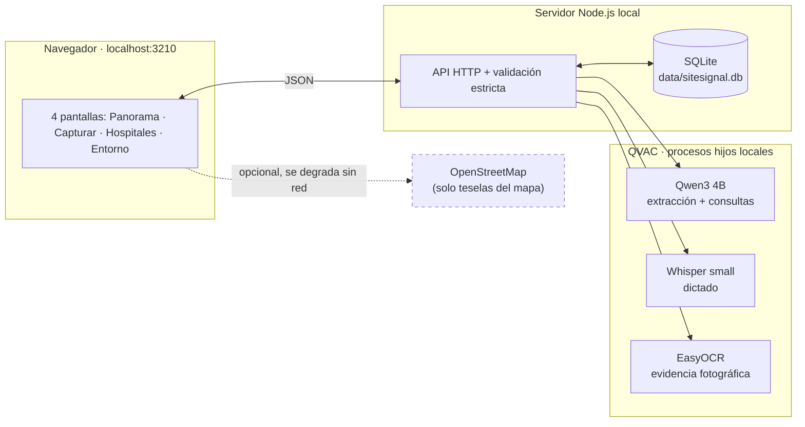

# SiteSignal

**Inteligencia de base instalada, 100% local.** Convierte lo que un ingeniero de servicio, vendedor o especialista observa en una visita hospitalaria en una base instalada confiable y consultable — sin que ningún dato salga de la computadora.

Prototipo para el reto corporativo **Inteligencia de Base Instalada de Clientes**, presentado por Philips.

---

## El problema

El conocimiento sobre qué equipos hay realmente instalados en cada hospital vive disperso en la memoria y las notas sueltas de quienes visitan el sitio. Nadie lo consolida, nadie lo contrasta, y las decisiones de renovación se toman con información vieja o incompleta.

## Qué hace SiteSignal

- **Captura sin fricción**: escribe o dicta el relato en español o inglés.
- **Extracción local con IA**: QVAC (Qwen3 4B) estructura el relato — nunca inventa un dato que el texto no respalde.
- **Revisión humana obligatoria**: nada se guarda sin confirmación de un colaborador.
- **Confianza explicable**: `Confirmado`, `Reportado`, `Estimado` o `Desconocido`, con puntaje desglosado.
- **Evidencia fotográfica**: OCR local lee fabricante, modelo, serie y año de una foto de la placa.
- **Duplicados y conflictos nunca se resuelven solos**: la app sugiere, una persona decide.
- **Panorama regional con mapa real**: filtros por país/ciudad/modalidad y preguntas en lenguaje natural.
- **Oportunidades de renovación explicables**: condiciones visibles, nunca una caja negra.
- **Exportación abierta**: CSV y JSON completo con procedencia, en un clic.

## Arquitectura

Todo corre en un solo proceso Node.js local. QVAC se ejecuta en procesos hijos aislados; la única llamada de red en tiempo de ejecución es opcional (el mapa base) y todo sigue funcionando sin ella.



## Inicio rápido (Windows, con conexión la primera vez)

1. Instala **Node.js 24+**. Abre PowerShell en este repositorio.
2. `npm ci`
3. `npx qvac doctor` — comprueba el runtime.
4. `npm run qvac:prepare:text` — descarga Qwen3 4B Q4_K_M (~2.5 GB) y muestra la ruta local exacta.
5. Arranca con esa ruta:

```powershell
$env:SITESIGNAL_MODEL = 'C:\Users\tu-usuario\.qvac\models\archivo_Qwen3-4B-Q4_K_M.gguf'
.\Start-SiteSignal.ps1
```

Si PowerShell bloquea scripts: `powershell -ExecutionPolicy Bypass -File .\Start-SiteSignal.ps1`. El iniciador abre el navegador cuando el servidor ya escucha en `http://127.0.0.1:3210`. También puedes usar `npm start` y abrir la URL manualmente.

Voz y evidencia fotográfica son opcionales — ver [Funciones](#funciones).

## Funciones

**Extracción y revisión** — cada dato se valida contra un schema estricto y la cláusula del relato que lo respalda; un valor sin respaldo literal se rechaza. Un único reintento corrige salidas inválidas; si no queda nada útil, abre tarjetas vacías con procedencia `Manual`. Hasta tres preguntas de seguimiento completan lo que falta, nombrando la modalidad conocida en vez de un genérico "Equipo 2".

**Confianza explicable** — cada campo es `Confirmado`, `Reportado`, `Estimado` o `Desconocido`. El puntaje suma 40 pts de completitud + 25 de vigencia (decrece a cero en doce meses) + 35 de evidencia o confirmación independiente. Bandas: Baja 0–49, Media 50–79, Alta 80–100.

**Grupos, duplicados y conflictos** — una cantidad conjunta se guarda como grupo, sin inventar series ni identidades; se separa registrando una unidad con serie propia. Una serie idéntica es coincidencia fuerte; sin serie, se sugieren candidatos comparables lado a lado — **solo una decisión humana explícita consolida**. Conflictos y correcciones quedan en un historial auditable. Si nombre, cliente, ciudad y país ya coinciden con un hospital existente, el destino se autoselecciona.

**Panorama regional** — dataset determinista de doce hospitales y setenta y dos equipos ficticios en cinco países. Hospital, cliente y colaboradores son enteramente ficticios; fabricante y modelo usan marcas reales del sector (Philips, GE Healthcare, Siemens Healthineers, Canon Medical, Mindray) — nombres públicos de producto, no datos de pacientes. Mapa Leaflet con coordenadas locales (sin geocodificación en línea), filtros por región/país/ciudad/modalidad, y consultas en **lenguaje natural** que QVAC traduce a filtros visibles y editables — nunca genera ni ejecuta SQL.

**Dictado de voz** *(opcional)* — graba y transcribe en el equipo con Whisper local, en español o inglés; llena el mismo cuadro de texto y sigue el flujo normal.

```powershell
npm run qvac:prepare:voice
$env:SITESIGNAL_VOICE_MODEL = 'ruta que muestre el comando anterior'
```

**Evidencia fotográfica** *(opcional)* — OCR local (EasyOCR) lee la placa del equipo; un analizador determinista confirma solo lo que el propio texto respalda, directo a `Confirmado`.

```powershell
npm run qvac:prepare:photo
$env:SITESIGNAL_PLATE_MODEL = 'ruta que muestre el comando anterior'
```

**Exportación** — desde **Entorno**: CSV de la base instalada y JSON completo (observaciones, conflictos, historial, oportunidades, evidencia) reflejando el estado exacto en ese momento.

## Privacidad y ejecución sin conexión

La única petición externa opcional en ejecución son las teselas del mapa; sin conexión, muestra un aviso y sigue funcionando con marcadores sobre fondo neutro. El arranque normal nunca descarga pesos — solo la preparación inicial (`npm ci`, `qvac:prepare:*`) requiere red, una sola vez.

**Prueba real**: prepara los tres modelos con conexión, desconéctala, y ejecuta `npm start`. Captura, revisión, voz, evidencia, consultas, perfiles y exportaciones siguen disponibles sin error.

## Validación

```powershell
npm run typecheck
npm test
```

Las pruebas usan SQLite temporal real y un adaptador de texto determinista — no dependen de QVAC. Para probar la inferencia real: `npm run qvac:check:text` / `qvac:check:voice` / `qvac:check:photo`, con la variable de entorno correspondiente configurada.

## Garantías del prototipo frente a producción

Demuestra el flujo completo con inferencia local y sin datos reales, pero **no** implementa controles de producción: sin cifrado en disco, sin autenticación multiusuario (el "perfil" es solo una etiqueta de procedencia), sin auditoría a prueba de manipulación ni alta disponibilidad. Una implementación real necesitaría esos controles antes de manejar información de pacientes o clientes.

## Variables de entorno

| Variable | Requerida | Uso |
|---|---|---|
| `SITESIGNAL_MODEL` | Sí | Ruta al modelo de texto Qwen3 4B |
| `SITESIGNAL_VOICE_MODEL` | No | Habilita el dictado de voz |
| `SITESIGNAL_PLATE_MODEL` | No | Habilita la evidencia fotográfica |
| `SITESIGNAL_PORT` | No | Puerto (1–65535); por defecto 3210 |
| `SITESIGNAL_DATA` | No | Directorio de almacenamiento local |

## Stack

Sin frameworks de frontend ni bundlers: HTML, CSS y JavaScript nativo servidos directamente desde `public/`.

| Capa | Tecnología |
|---|---|
| Servidor | Node.js (`node:http`, `node:sqlite`) |
| Inferencia local | `@qvac/sdk` — Qwen3 4B, Whisper small, EasyOCR |
| Validación | `zod` |
| Imágenes | `sharp` |
| Mapa | `leaflet` + OpenStreetMap |

## Más recursos

- 🎬 [`DEMO.md`](DEMO.md) — guion de demostración de 5 minutos.
- 📋 [`CONTEXT.md`](CONTEXT.md) — vocabulario de dominio compartido.
- 🗂️ [`HANDOFF.md`](HANDOFF.md) — historial técnico completo para retomar el desarrollo.

---

Todo dato de demostración es sintético. No se incluye información de pacientes o clientes reales.
