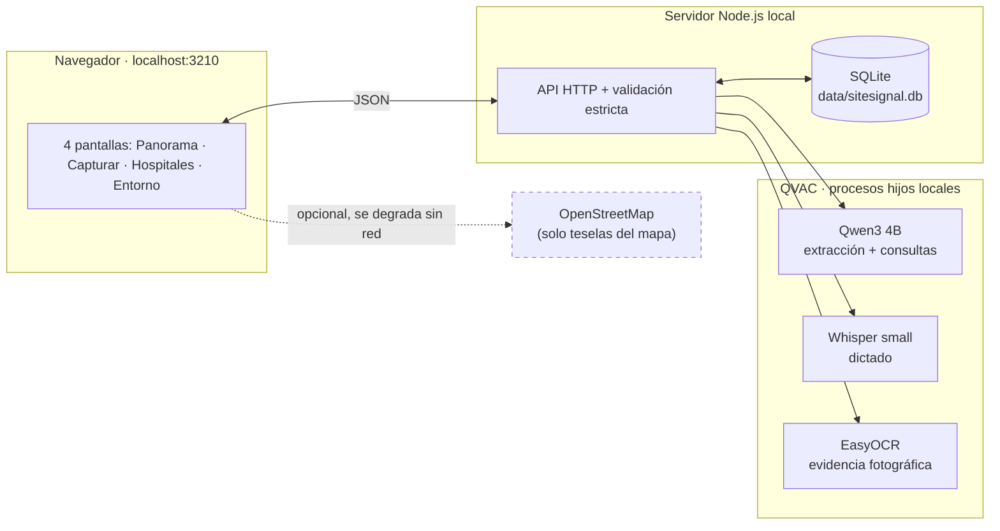

# SiteSignal

**Inteligencia de base instalada, 100% local.** Convierte lo que un ingeniero de servicio, vendedor o especialista observa en una visita hospitalaria en una base instalada confiable y consultable — sin que ningún dato salga de la computadora.

Prototipo para el reto corporativo **Inteligencia de Base Instalada de Clientes**, presentado por Philips.

---

## El problema

El conocimiento sobre qué equipos hay realmente instalados en cada hospital vive disperso en la memoria y las notas sueltas de quienes visitan el sitio. Nadie lo consolida, nadie lo contrasta, y las decisiones de renovación se toman con información vieja o incompleta.

## Qué hace SiteSignal

- **Captura sin fricción**: escribe o dicta el relato de la visita en español o inglés.
- **Extracción local con IA**: un modelo QVAC (Qwen3 4B) convierte el relato en campos estructurados — nunca inventa un dato que el texto no respalde.
- **Revisión humana obligatoria**: nada se guarda sin que un colaborador confirme la interpretación.
- **Confianza explicable**: cada dato queda como `Confirmado`, `Reportado`, `Estimado` o `Desconocido`, con un puntaje desglosado (completitud, vigencia, evidencia).
- **Evidencia fotográfica**: sube una foto de la placa del equipo y OCR local extrae fabricante, modelo, serie y año.
- **Duplicados y conflictos nunca se resuelven solos**: la app sugiere, pero una persona decide.
- **Panorama regional con mapa real**: filtra por país, ciudad, modalidad, confianza y vigencia; pregúntale en lenguaje natural.
- **Oportunidades de renovación explicables**: señala equipos candidatos con sus condiciones visibles, nunca una caja negra.
- **Exportación abierta**: CSV de la base instalada y JSON completo con procedencia, en un clic.

## Arquitectura

Todo corre en un solo proceso Node.js local. QVAC se ejecuta en procesos hijos aislados; la única llamada de red en tiempo de ejecución es opcional (el mapa base) y todo sigue funcionando sin ella.



## Inicio rápido (Windows, con conexión la primera vez)

1. Instala **Node.js 24+** (probado con 26.7.0). Abre PowerShell en este repositorio.
2. `npm ci`
3. `npx qvac doctor` — comprueba el runtime.
4. `npm run qvac:prepare:text` — descarga Qwen3 4B Q4_K_M (~2.5 GB) y muestra la ruta local exacta. Hazlo antes de desconectarte.
5. Arranca con la ruta que te mostró el paso anterior:

```powershell
$env:SITESIGNAL_MODEL = 'C:\Users\tu-usuario\.qvac\models\archivo_Qwen3-4B-Q4_K_M.gguf'
.\Start-SiteSignal.ps1
```

Si PowerShell bloquea scripts: `powershell -ExecutionPolicy Bypass -File .\Start-SiteSignal.ps1`. El iniciador abre el navegador solo cuando el servidor ya escucha en `http://127.0.0.1:3210`. También puedes usar `npm start` y abrir la URL manualmente.

Voz y evidencia fotográfica son opcionales — ver [Funciones](#funciones) más abajo para prepararlas.

## Funciones

### Extracción de texto y revisión

Cada extracción se valida contra un schema estricto, el catálogo de modalidades y la cláusula del relato asociada a cada equipo — un valor sin respaldo literal en el texto se rechaza. Si la primera salida de QVAC es inválida, SiteSignal reintenta una vez con instrucciones correctivas; puede conservar una extracción parcial cuando quedan un hospital y una modalidad respaldados, dejando los campos dudosos vacíos para revisión. Si no queda nada útil, abre tarjetas vacías, conserva el relato original y registra procedencia `Manual`.

### Preguntas de seguimiento

SiteSignal formula hasta tres preguntas, una por vez, en este orden: hospital, modalidad, cantidad, fabricante, modelo y antigüedad — cada una permite responder "No lo sé". Cuando ya se conoce la modalidad de un equipo, la pregunta la nombra directamente ("¿Cuántos equipos de Tomografía computarizada observaste?") en vez de un genérico "Equipo 2".

### Confianza explicable

Cada campo se muestra como `Confirmado`, `Reportado`, `Estimado` o `Desconocido`; el estado general toma el más débil entre hospital, modalidad y cantidad. La confianza suma hasta **40 puntos de completitud** (hospital 8; por equipo: modalidad 8, cantidad 8, fabricante 5, modelo 5, antigüedad 6), **25 de vigencia** (decrece linealmente a cero a los doce meses) y **35 según evidencia o confirmación independiente**. Bandas: Baja 0–49, Media 50–79, Alta 80–100. Serie y área conservan su estado sin reducir el puntaje, porque pueden no aplicar.

### Grupos, duplicados y conflictos

Una cantidad conjunta se incorpora como un **grupo**, sin inventar números de serie ni identidades. Para separar una unidad: registra una nueva observación con cantidad 1 y número de serie, selecciona el hospital existente y relaciónala con el grupo — la unidad conserva ambas observaciones como procedencia, y el grupo reduce su cantidad sin alterar el total.

Una serie idéntica es coincidencia fuerte de duplicado. Sin serie, SiteSignal sugiere candidatos cuando coinciden hospital, modalidad y al menos otro dato — la comparación muestra coincidencias y diferencias lado a lado, y **solo una decisión humana explícita consolida**. Observaciones incompatibles sobre el mismo equipo quedan como conflictos pendientes hasta que alguien elige un valor respaldado y explica por qué. Toda corrección registra valor anterior, valor nuevo, autor, fecha y motivo, y queda en un historial separado de la proyección actual.

Si el nombre, cliente, ciudad y país de una nueva observación ya coinciden con un hospital existente (incluso si uno de los dos omite la palabra genérica "Hospital"/"Clínica"), el destino se autoselecciona — nunca se deja crear un segundo registro para el mismo sitio.

### Panorama regional

Dataset determinista de **doce hospitales y setenta y dos equipos** ficticios en cinco países (Panamá, Brasil, Colombia, México, Chile). El hospital, cliente y colaboradores son enteramente ficticios; el fabricante y modelo de cada equipo usan **marcas reales del sector médico** (Philips, GE Healthcare, Siemens Healthineers, Canon Medical, Mindray) con un modelo plausible por modalidad — son nombres públicos de productos, no datos de ningún paciente o cliente, y hacen que la demostración se lea como una base instalada real.

Un mapa **Leaflet** ubica cada hospital por coordenadas resueltas desde un catálogo local (sin geocodificación en línea); resume hospitales, equipos, confianza, información desactualizada y oportunidades; filtra por cliente, hospital, región, país, ciudad y modalidad. Las capturas guardadas se incorporan y se distinguen del dataset precargado — restablecer la demo no las borra.

### Consultas en lenguaje natural

Pregúntale al panorama en español o inglés. QVAC interpreta **únicamente filtros visibles** (ubicación, cliente, hospital, modalidad, antigüedad, estado, confianza, vigencia), editables o removibles antes de aplicar. SiteSignal valida cada valor contra el catálogo local y contra las palabras de la pregunta, y explica el resultado. Las solicitudes ambiguas no aplican filtros — **el modelo nunca genera ni ejecuta SQL**.

### Dictado de voz *(opcional)*

Graba la observación desde el navegador, elige español o inglés, y transcríbela en este equipo con QVAC (Whisper small multilingüe, decodificación determinista). Ningún audio sale a la nube; la transcripción llena el mismo cuadro de texto y sigue el flujo normal de revisión.

```powershell
npm run qvac:prepare:voice   # descarga ggml-small-q8_0.bin (~264 MB)
$env:SITESIGNAL_VOICE_MODEL = 'ruta que te muestre el comando anterior'
```

Sin esa variable, el dictado queda deshabilitado y la captura escrita sigue intacta.

### Evidencia fotográfica *(opcional)*

Cada tarjeta de equipo admite una foto de su placa o etiqueta. OCR local (EasyOCR) detecta el texto; un analizador determinista — sin LLM — busca las etiquetas conocidas de fabricante, modelo, serie y fecha, y solo confirma un campo cuando el propio texto de la placa lo respalda. Los campos con respaldo fotográfico llegan directo a `Confirmado`.

```powershell
npm run qvac:prepare:photo   # descarga el modelo de OCR (~98 MB)
$env:SITESIGNAL_PLATE_MODEL = 'ruta que te muestre el comando anterior'
```

Sin esa variable, la evidencia fotográfica queda deshabilitada y el resto de la captura sigue funcionando.

### Exportaciones

Desde la pantalla **Entorno**: "Exportar base instalada (CSV)" y "Exportar observaciones y evidencia (JSON)", ambas reflejando el estado exacto en ese momento (nunca una copia rezagada) y cubriendo solo lo capturado localmente — el dataset ficticio ya es reproducible desde el panorama, así que no se duplica en el archivo. El CSV es una fila por equipo con el estado de cada campo; el JSON incluye, por hospital, observaciones completas, base instalada con conflictos e historial, oportunidades, y referencias a evidencia fotográfica (metadata y texto OCR, nunca los bytes de la imagen).

## Privacidad y ejecución sin conexión

Toda la interfaz (HTML, CSS, JS, Leaflet) se sirve desde `http://127.0.0.1:3210`. La **única** petición externa opcional en ejecución son las teselas del mapa base de OpenStreetMap; sin conexión, el mapa muestra un aviso discreto y sigue mostrando marcadores sobre fondo neutro — nada más se ve afectado. El arranque normal solo lee las rutas de modelo ya configuradas y **nunca descarga pesos**.

La preparación (`npm ci`, `npx qvac doctor`, cada `qvac:prepare:*`) sí requiere conexión, una sola vez, para poblar la caché local de QVAC (`~/.qvac/models`).

**Prueba real**: prepara los tres modelos con conexión, desconéctala, y ejecuta `npm start` con las tres variables configuradas. Captura, revisión, voz, evidencia, consultas, perfiles y exportaciones siguen disponibles sin ningún error.

## Validación

```powershell
npm run typecheck
npm test
```

Las pruebas consultan la API HTTP con SQLite temporal real y un adaptador de texto determinista — no dependen de QVAC ni de la red. Para probar la extracción real:

```powershell
$env:SITESIGNAL_MODEL = '...'
npm run qvac:check:text     # extracción de texto en español e inglés

$env:SITESIGNAL_VOICE_MODEL = '...'
npm run qvac:check:voice    # transcribe dos muestras sintéticas de test/fixtures/

$env:SITESIGNAL_PLATE_MODEL = '...'
npm run qvac:check:photo    # analiza dos placas ficticias de test/fixtures/
```

Las respuestas de QVAC varían según el modelo y siempre pasan por revisión humana antes de guardarse.

## Garantías del prototipo frente a producción

Este prototipo demuestra el flujo completo (captura, revisión, base instalada, panorama, exportación) con inferencia local y sin datos reales, pero **no** implementa controles de nivel de producción: sin cifrado de la base SQLite ni de los exports, sin control de acceso corporativo o autenticación multiusuario (el "perfil" es una etiqueta de procedencia local, no una identidad verificada), sin auditoría a prueba de manipulación, sin alta disponibilidad, sin gestión de vulnerabilidades de terceros. Una implementación real necesitaría esos controles antes de manejar información de pacientes o clientes.

## Variables de entorno

| Variable | Requerida | Uso |
|---|---|---|
| `SITESIGNAL_MODEL` | Sí | Ruta al modelo de texto Qwen3 4B |
| `SITESIGNAL_VOICE_MODEL` | No | Habilita el dictado de voz |
| `SITESIGNAL_PLATE_MODEL` | No | Habilita la evidencia fotográfica |
| `SITESIGNAL_PORT` | No | Puerto (1–65535); por defecto 3210 |
| `SITESIGNAL_DATA` | No | Directorio de almacenamiento local |

Un modelo de texto ausente abre la interfaz igual, con instrucciones de recuperación. Un puerto ocupado o almacenamiento sin permisos impide arrancar y lo indica en terminal; nunca se modifica ni elimina una base existente.

## Stack y modelos

Sin frameworks de frontend ni bundlers: HTML, CSS y JavaScript nativo (módulos ES) servidos directamente desde `public/`.

| Capa | Tecnología |
|---|---|
| Servidor | Node.js (`node:http`, `node:sqlite`) |
| Inferencia local | `@qvac/sdk` — Qwen3 4B Q4_K_M, Whisper small Q8_0, EasyOCR |
| Validación | `zod` |
| Imágenes | `sharp` (ampliación local previa al OCR) |
| Mapa | `leaflet` + tiles de OpenStreetMap |
| Persistencia | SQLite (`data/sitesignal.db`) |

Hardware de referencia probado: AMD Ryzen 7 8845HS (8 núcleos físicos / 16 lógicos), 16 GB RAM, GPU integrada AMD Radeon 780M — toda la inferencia sobre CPU. La pantalla **Entorno** declara el hardware detectado en cada equipo donde se ejecute.

## Más recursos

- 🎬 [`DEMO.md`](DEMO.md) — guion de demostración de 5 minutos.
- 📋 [`CONTEXT.md`](CONTEXT.md) — vocabulario de dominio compartido.
- 🗂️ [`HANDOFF.md`](HANDOFF.md) — historial técnico completo para retomar el desarrollo.

---

Todo dato de demostración es sintético. No se incluye información de pacientes o clientes reales.
